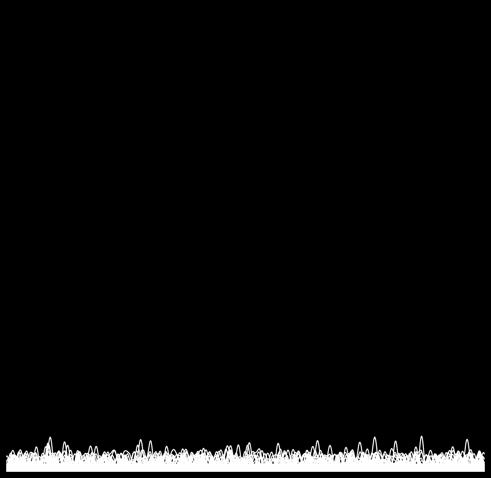
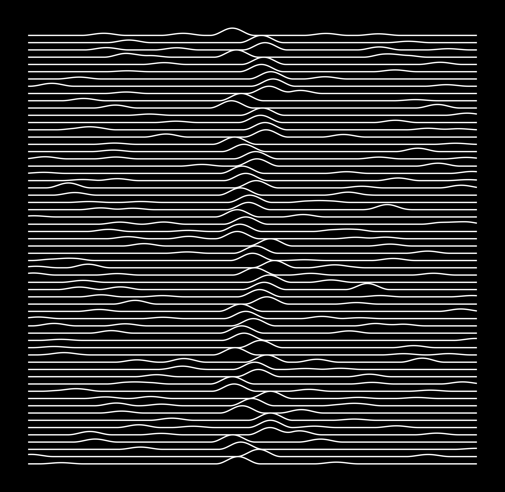
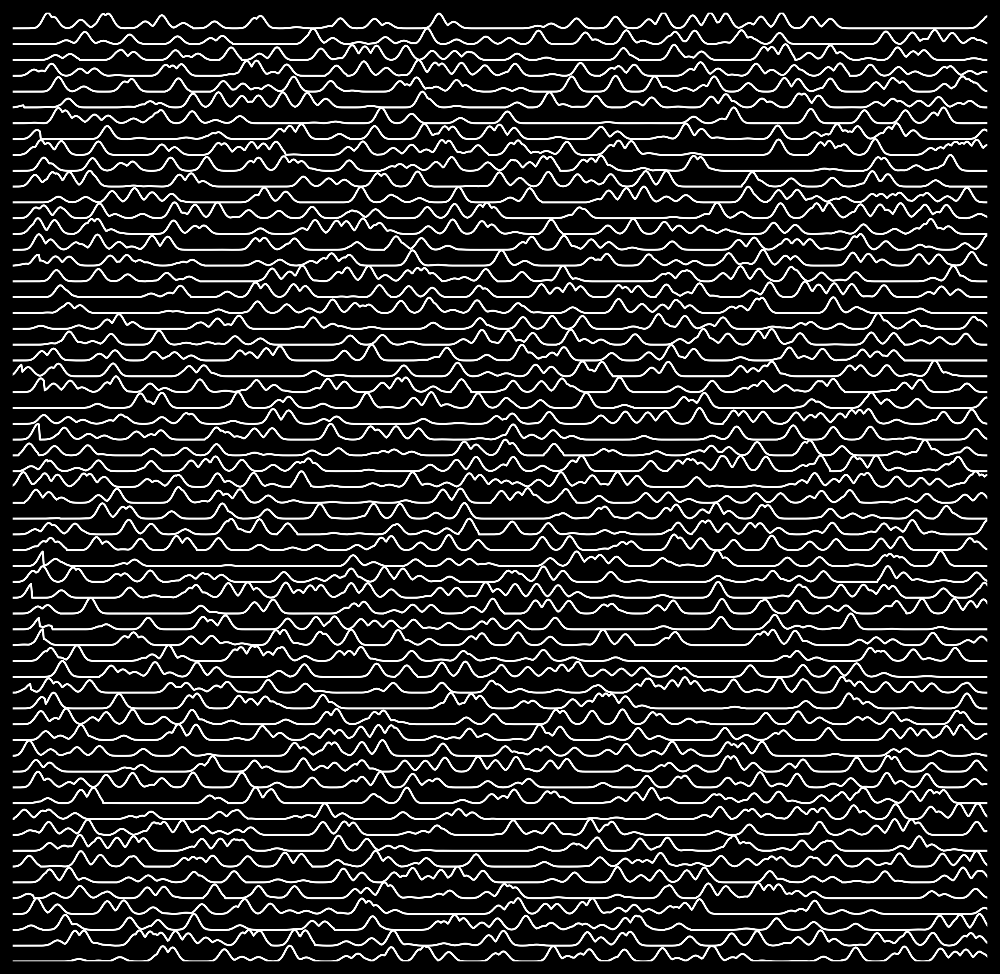
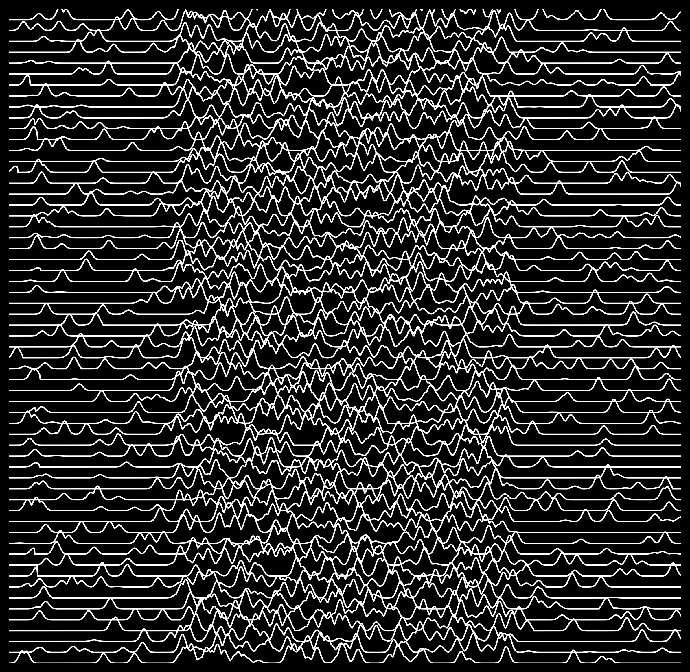
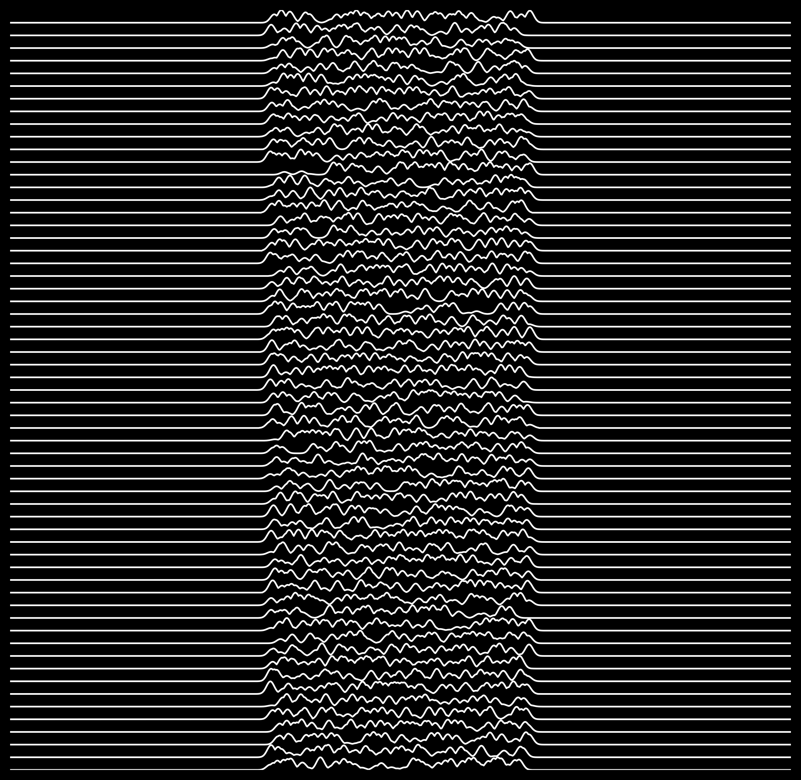

inspired art from Joy Division's Unknown Pleasures album cover

generated after a short time learning matplotlib and numpy

TODO: buy vinyl record of [UNKNOWN PLEASURES](https://www.youtube.com/watch?v=oo7lt0lLOvg), srsly

# pics

5 hd images below (roughly 1MB each):

# gif

compressed

